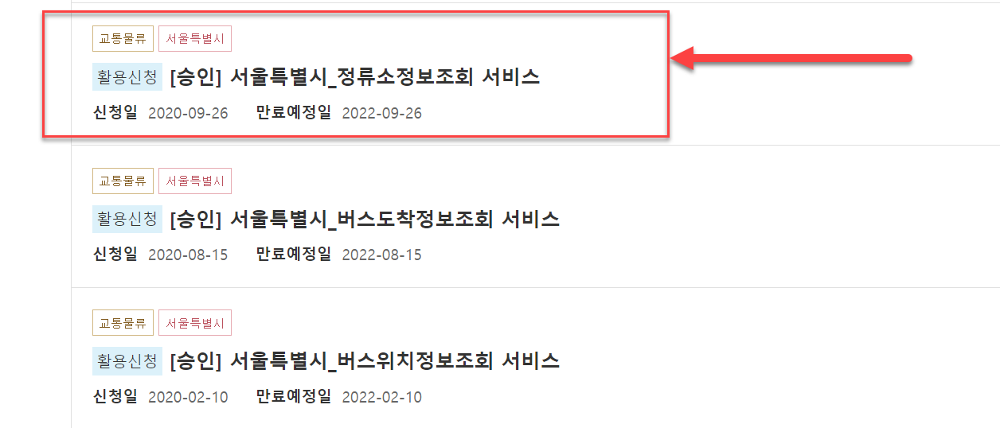
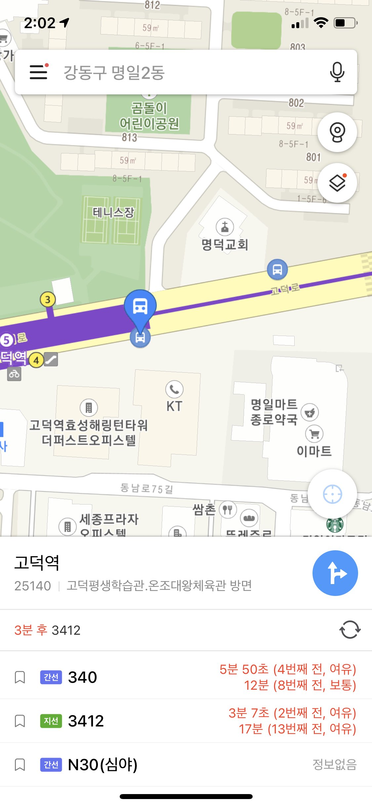

# venv 세팅
```shell
> python3.8 -m venv venv
```
또는  
```shell
> python -m venv venv
```
>>>
### 윈도우10  
```
> venv\\Scripts\activate.bat
```
### 리눅스/맥
```
> ./venv/Scripts/activate
```

### 모듈 설치
- 반드시 venv 실행된 상태에서 진행해야함.
```
(venv)> pip install requests
```

---
# 서울시 버스정류장 정보 조회 서비스
- 참조 문서: https://www.data.go.kr/tcs/dss/selectApiDataDetailView.do?publicDataPk=15000303
- 제공상세문서의 각종 코드 값을 반드시 참조해야 함.

### 메인 모듈
> python3 101.py
  
### 공공데이터포털에서 서비스 선택


### 버스정류장 정보 조회 모바일 예시

  
